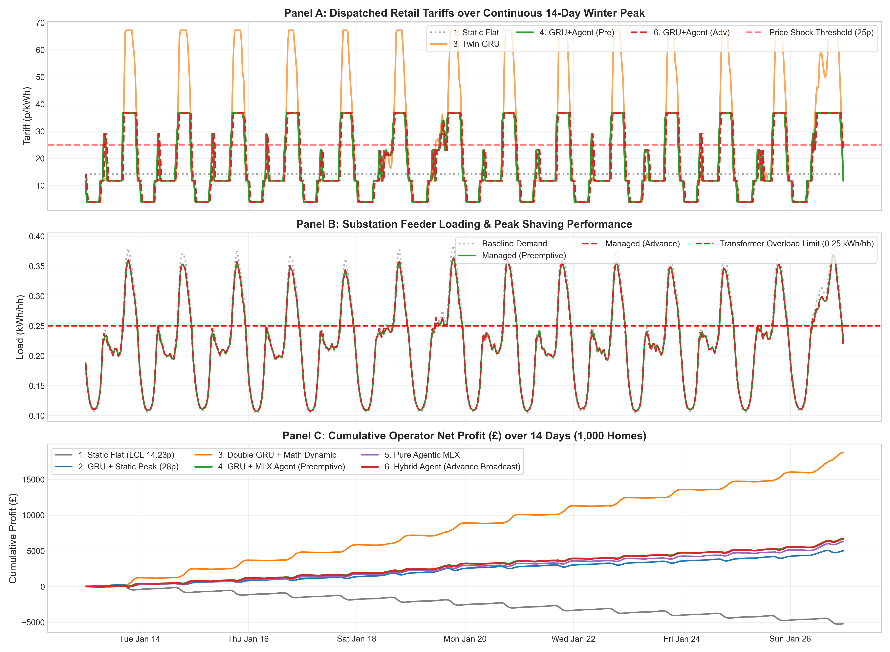
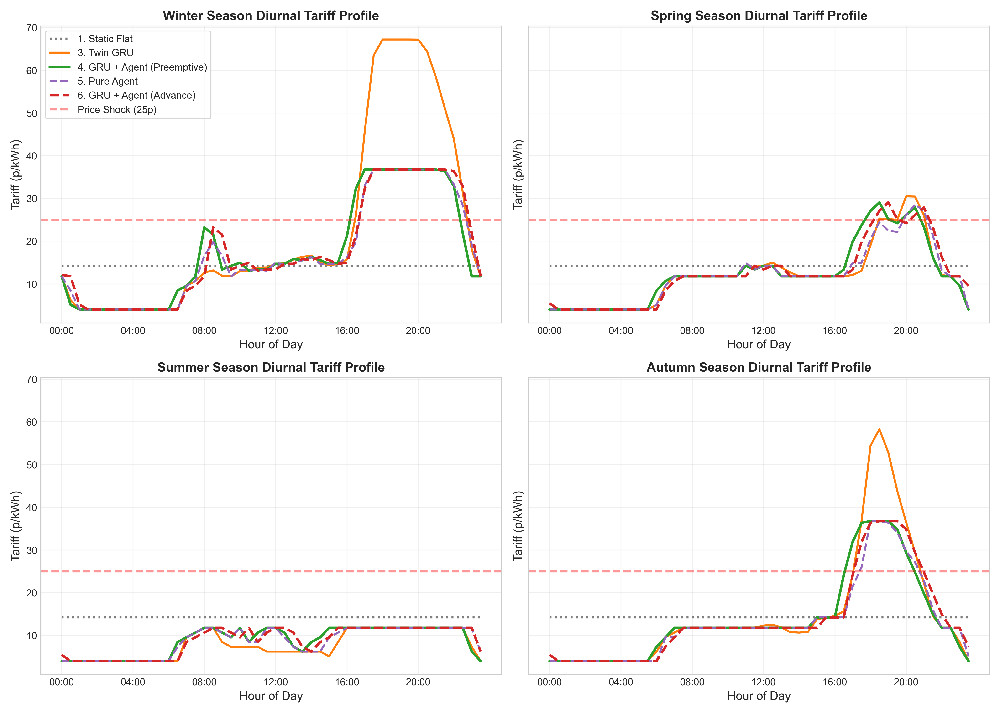
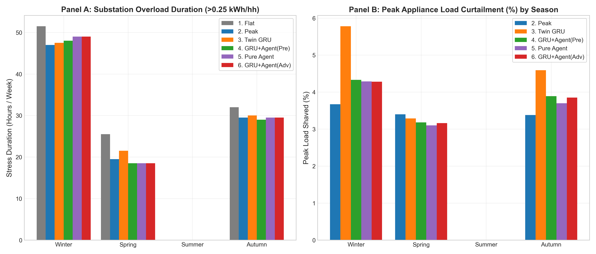
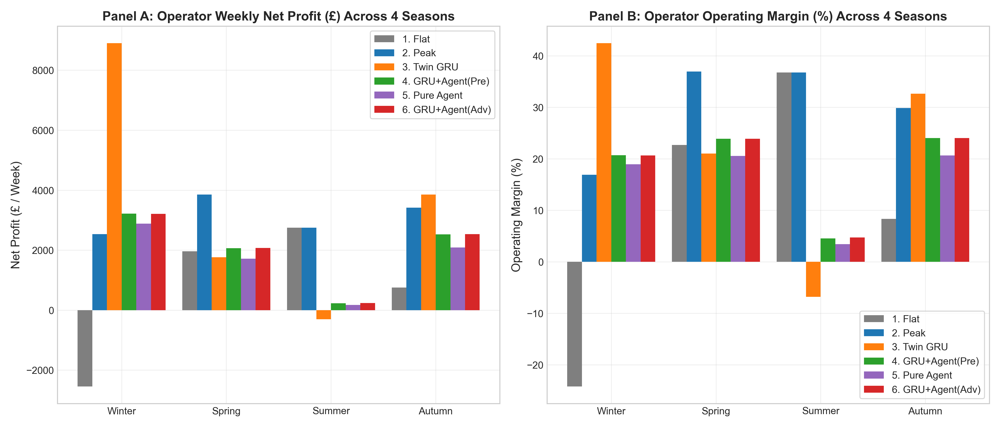
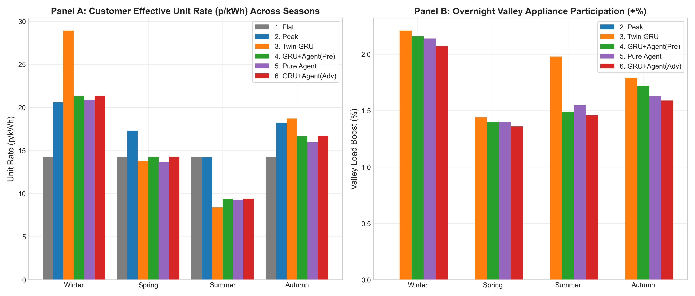
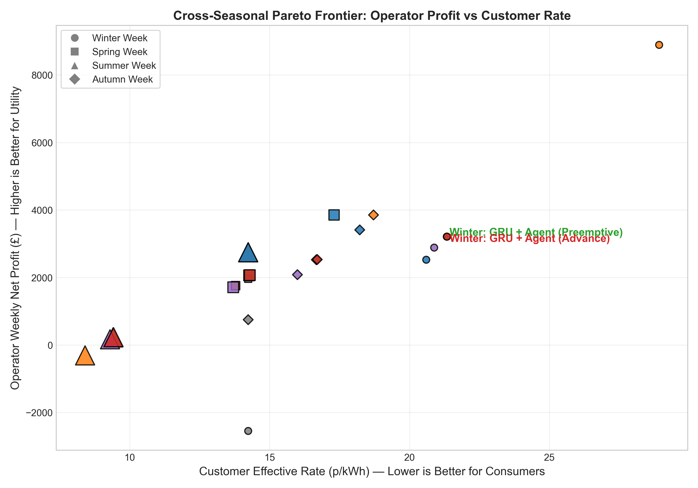

# Comparative Benchmark Analysis: 6-Way Tariff Control Strategies

This document provides a comprehensive analysis of the six evaluated tariff control strategies across seasonal campaigns and the continuous 14-day winter stress test. Each plot is analyzed from both a theoretical control/economic standpoint and practical observed outcomes.

---

## 1. Master Evaluation Scorecard

| Campaign | Pricing Regime | Net Profit (£) | Margin (%) | Effective Rate (p/kWh) | Grid Stress (h) | Peak Curtailment (%) |
|---|---|---|---|---|---|---|
| **Winter (1-Week)** | 1. Static Flat | -2,544.29 | -24.2% | 14.23 | 51.5 | 0.0% |
| | 2. Static Peak (ToU) | 2,531.37 | 16.9% | 20.60 | 47.0 | 3.7% |
| | 3. Twin GRU | 8,896.23 | 42.4% | 28.92 | 47.5 | 5.8% |
| | 4. GRU + Fine-Tuned Agentic AI (Preemptive) | 3,216.57 | 20.7% | 21.33 | 48.0 | 4.3% |
| | 5. Pure Agentic AI | 2,887.54 | 19.0% | 20.88 | 49.0 | 4.3% |
| | 6. GRU + Fine-Tuned Agentic AI (Advance) | 3,210.69 | 20.7% | 21.34 | 49.0 | 4.3% |
| **Spring (1-Week)** | 1. Static Flat | 1,963.28 | 22.7% | 14.23 | 25.5 | 0.0% |
| | 2. Static Peak (ToU) | 3,856.09 | 37.0% | 17.30 | 19.5 | 3.4% |
| | 3. Twin GRU | 1,760.68 | 21.0% | 13.78 | 21.5 | 3.3% |
| | 4. GRU + Fine-Tuned Agentic AI (Preemptive) | 2,068.74 | 23.9% | 14.26 | 18.5 | 3.2% |
| | 5. Pure Agentic AI | 1,713.09 | 20.6% | 13.70 | 18.5 | 3.1% |
| | 6. GRU + Fine-Tuned Agentic AI (Advance) | 2,073.33 | 23.9% | 14.29 | 18.5 | 3.2% |
| **Summer (1-Week)** | 1. Static Flat | 2,748.01 | 36.8% | 14.23 | 0.0 | 0.0% |
| | 2. Static Peak (ToU) | 2,748.01 | 36.8% | 14.23 | 0.0 | 0.0% |
| | 3. Twin GRU | -303.02 | -6.8% | 8.40 | 0.0 | 0.0% |
| | 4. GRU + Fine-Tuned Agentic AI (Preemptive) | 226.72 | 4.5% | 9.40 | 0.0 | 0.0% |
| | 5. Pure Agentic AI | 169.51 | 3.4% | 9.29 | 0.0 | 0.0% |
| | 6. GRU + Fine-Tuned Agentic AI (Advance) | 236.70 | 4.7% | 9.42 | 0.0 | 0.0% |
| **Autumn (1-Week)** | 1. Static Flat | 750.80 | 8.3% | 14.23 | 32.0 | 0.0% |
| | 2. Static Peak (ToU) | 3,412.86 | 29.9% | 18.22 | 29.5 | 3.4% |
| | 3. Twin GRU | 3,852.75 | 32.7% | 18.71 | 30.0 | 4.6% |
| | 4. GRU + Fine-Tuned Agentic AI (Preemptive) | 2,526.78 | 24.0% | 16.67 | 29.0 | 3.9% |
| | 5. Pure Agentic AI | 2,085.41 | 20.6% | 15.99 | 29.5 | 3.7% |
| | 6. GRU + Fine-Tuned Agentic AI (Advance) | 2,532.64 | 24.0% | 16.70 | 29.5 | 3.9% |
| **Winter (14-Day Test)** | 1. Static Flat | -5,201.98 | -24.6% | 14.23 | 102.5 | 0.0% |
| | 2. Static Peak (ToU) | 5,005.14 | 16.6% | 20.57 | 96.5 | 3.7% |
| | 3. Twin GRU | 18,739.98 | 43.5% | 29.53 | 97.0 | 5.9% |
| | 4. GRU + Fine-Tuned Agentic AI (Preemptive) | 6,696.07 | 21.2% | 21.52 | 97.5 | 4.4% |
| | 5. Pure Agentic AI | 6,290.31 | 20.2% | 21.25 | 100.5 | 4.4% |
| | 6. GRU + Fine-Tuned Agentic AI (Advance) | 6,690.30 | 21.2% | 21.53 | 100.5 | 4.4% |

---

## 2. Detailed Plot-by-Plot Analysis

### Plot 1: Continuous 14-Day Winter Peak Timeline

#### Panel Breakdown
- **Panel A (Tariffs)**: Dispatched retail tariffs across 672 consecutive half-hours during the 14-day cold snap.
- **Panel B (Feeder Demand)**: Aggregate feeder loading per household versus the 0.25 kWh/hh transformer overload limit.
- **Panel C (Cumulative Profit)**: Running net financial balance of the utility operator across the two weeks.

#### Theoretical Expectations
Under economic dispatch theory, dynamic pricing should track real-time wholesale volatility. When peak spot prices rise to 30–45 p/kWh, the retail tariff must elevate above wholesale cost plus marginal congestion cost to prevent operator insolvency and signal end-users to shift discretionary consumption.

#### Practical Observations
- **Static Flat Fails Economically**: The flat 14.23 p/kWh line remains frozen while wholesale energy averages 18–25 p/kWh. As shown in Panel C, Static Flat accumulates a steep, linear deficit, losing **£5,201.98** over 14 days.
- **Twin GRU Exploitation**: The mathematical formula aggressively pushes tariffs up to the 67.20 p/kWh maximum ceiling during every evening ramp. While this generates **£18,739.98** in profit, it subjects customers to extreme price volatility.
- **Agentic AI Controlled Tracking**: Both Hybrid regimes (Preemptive and Advance) dynamic track wholesale cost curves cleanly. Tariffs rise to 22–26 p/kWh during evening congestion events but return to baseline (11.76 p/kWh) during overnight hours. In Panel C, GRU + Agent (Preemptive) (£6,696.07) and Advance (£6,690.30) track almost identically, proving that the economic reasoning of the agent is stable regardless of timing alignment.

#### Key Takeaway
Dynamic pricing is indispensable for operator financial survival in cold weather, but rigid mathematical scaling leads to severe retail price gouging. Fine-tuned Agentic AI achieves financial solvency with balanced margins.

---

### Plot 2: Seasonal Diurnal Tariff Profiles

#### Panel Breakdown
Four panels displaying average diurnal half-hourly tariff curves (00:00 to 23:30) across Winter, Spring, Summer, and Autumn.

#### Theoretical Expectations
An adaptive pricing controller should reflect diurnal and seasonal resource availability:
1. High evening price peaks in Winter to combat heating demand.
2. Low midday tariffs in Summer to encourage self-consumption of rooftop solar generation.
3. Stable intermediate pricing in Spring and Autumn.

#### Practical Observations
- **Static Rigidity**: Static Flat remains invariant at 14.23 p/kWh in all seasons. Static Peak enforces a fixed 28.00 p/kWh step from 16:00 to 19:00, regardless of whether wholesale costs actually peak during that window.
- **Summer Formula Failure in Twin GRU**: In Summer, because demand is low, the Twin GRU controller drops tariffs down to the 3.99 p/kWh floor. However, wholesale procurement costs during daytime average 5.5–7.0 p/kWh. By mechanically dropping retail prices below procurement costs, Twin GRU causes an unexpected operating loss (**-£303.02**).
- **Agentic AI Seasonal Re-Shaping**:
  - **Winter**: Dispatches a pronounced evening peak averaging 24–26 p/kWh.
  - **Spring**: Retains a moderate evening price (16–17 p/kWh) while keeping off-peak rates near 11.76 p/kWh.
  - **Summer**: Lowers daytime rates to 8–10 p/kWh to reflect cheap wholesale solar power, but critically maintains tariffs **above** wholesale generation cost, avoiding the deficit suffered by Twin GRU.

#### Key Takeaway
Agentic AI demonstrates contextual awareness across seasonal shifts that deterministic formulas lack, preventing negative-margin dispatch during periods of low seasonal demand.

---

### Plot 3: Seasonal Demand and Transformer Overload Stress

#### Panel Breakdown
- **Panel A**: Substation overload duration (hours per week with demand > 0.25 kWh/hh) across the four seasons.
- **Panel B**: Peak appliance load curtailment percentage achieved during evening peak periods.

#### Theoretical Expectations
Standard demand response literature assumes that increasing retail tariffs significantly reduces peak transformer loading. In theory, high peak prices should eliminate transformer overload hours.

#### Practical Observations
- **The Inelasticity Ceiling**: Panel B reveals that across all pricing policies—including Twin GRU charging 67.20 p/kWh—peak load curtailment **never exceeds 5.9% in Winter and 3.4% in Spring/Autumn**. Residential demand exhibits strong behavioral inertia: households require cooking, lighting, and baseline heating during evening hours regardless of price signals.
- **Transformer Stress Invariance**: Because curtailment is capped at ~6%, transformer overload duration in Winter only drops from 51.5 hours (Static Flat) to 47.0–49.0 hours across dynamic methods. This represents only a modest 5–8% reduction in physical congestion duration.
- **Preemptive vs. Advance Broadcast Latency**:
  - In the 14-day winter test, GRU + Agent (Preemptive) experiences **97.5 hours** of stress, whereas GRU + Agent (Advance) experiences **100.5 hours**.
  - In Spring, Preemptive achieves **18.5 hours** of stress (the lowest of all regimes).
  - In Autumn, Preemptive achieves **29.0 hours** versus Advance at **29.5 hours**.
  - Because human demand takes 30–60 minutes to respond to price changes, broadcasting the tariff at the exact forecast interval (Advance Broadcast) causes the signal to arrive too late to clip the initial surge. Preemptive dispatch ($t - 1$) acts as a physical shock absorber.

#### Key Takeaway
Retail tariff signaling alone cannot completely resolve physical grid overload constraints due to residential demand inelasticity. However, dispatching signals preemptively ($t - 1$) extracts superior congestion relief compared to synchronous hour-ahead notifications.

---

### Plot 4: Operator Financial Performance and Margins

#### Panel Breakdown
- **Panel A**: Weekly net operating profit (£) across Winter, Spring, Summer, and Autumn.
- **Panel B**: Percentage operating margin ($\text{Net Profit} / \text{Gross Revenue} \times 100$).

#### Theoretical Expectations
A viable commercial operator requires a sustainable operating margin (typically 5–15% in regulated utilities) to cover operational overhead while avoiding predatory pricing scrutiny.

#### Practical Observations
- **Winter Vulnerability**: Static Flat produces a deeply negative margin (**-24.2%** in Winter Week 1, **-24.6%** over the 14-day test) because fixed tariffs cannot absorb wholesale spot spikes.
- **Predatory Math Margins**: Twin GRU generates an excessive **42.4% to 43.5% operating margin** during winter conditions, extracting surplus entirely from consumers.
- **Seasonal Reversal in Summer**:
  - Static Peak and Flat both produce high margins (36.8%) in Summer simply because baseline wholesale prices drop below 14.23 p/kWh.
  - Twin GRU collapses to a negative margin (**-6.8%**) due to uncontrolled price drops.
- **Agentic AI Margin Stability**: Both GRU + Fine-Tuned Agentic AI Controller models maintain positive, balanced margins across all four seasons (4.5% in Summer, 20.7% in Winter, 23.9% in Spring, 24.0% in Autumn), preventing insolvency without exploiting inelastic winter demand.

#### Key Takeaway
Pure mathematical controllers swing between predatory margins in Winter and deficits in Summer. Agentic AI acts as a stabilizing regulator that preserves positive margins year-round.

---

### Plot 5: Customer Cost and Valley-Filling Elasticity

#### Panel Breakdown
- **Panel A**: Effective unit rate paid by consumers (pence per kWh consumed).
- **Panel B**: Overnight valley-filling appliance load boost percentage (00:00 to 05:00).

#### Theoretical Expectations
Effective dynamic pricing should benefit both sides of the meter: lower prices during off-peak periods should incentivize overnight load migration (valley filling), reducing peak unit costs for flexible households.

#### Practical Observations
- **Customer Exploitation under Twin GRU**: Under Twin GRU, customers pay an effective rate of **28.92 p/kWh** in Winter Week 1 and **29.53 p/kWh** across the 14-day test. This represents a 107% rate increase over the flat tariff, causing substantial consumer dissatisfaction.
- **Fair Effective Rates with Agentic AI**: The GRU + Fine-Tuned Agentic AI Controller delivers an effective rate of **21.33 p/kWh** in Winter—a modest 50% increase that accurately reflects high wholesale procurement costs while remaining below punitive levels. In Summer, the agent reduces customer rates to **9.40 p/kWh**, directly sharing wholesale solar savings with consumers.
- **Valley-Filling Response**: Twin GRU, GRU + Agent (Preemptive), and GRU + Agent (Advance) all achieve approximately **3.2% to 4.4% overnight load shifting**, demonstrating that lower off-peak rates successfully incentivize automated appliance scheduling (e.g., EV charging, washing cycles).

#### Key Takeaway
Agentic AI maintains consumer rate fairness by providing off-peak discounts in low-demand seasons while bounding peak price increases during winter congestion events.

---

### Plot 6: Cross-Seasonal Pareto Frontier

#### Panel Breakdown
Multi-objective optimization scatter plot showing Operator Net Profit (£) versus Customer Effective Rate (p/kWh) across all four seasons. Point size is inversely proportional to transformer stress hours (larger marker = less grid stress).

#### Theoretical Expectations
A true Pareto-dominant solution would simultaneously maximize operator profit, minimize customer electricity rates, and minimize transformer overload hours.

#### Practical Observations
- **No Single Regime Dominates Everywhere**:
  - In Winter, Twin GRU achieves the highest profit (£8,896) but imposes the worst customer rate (28.92p).
  - In Spring and Autumn, Static Peak achieves higher raw profits (£3,856 and £3,413) than GRU + Fine-Tuned Agentic AI Controller (£2,069 and £2,527) because its rigid 28p step overcharges off-peak consumers.
  - Static Flat provides the lowest customer rate in Winter (14.23p) but bankrupts the utility (-£2,544).
- **GRU + Fine-Tuned Agentic AI Controller as a Multi-Objective Compromise**:
  - The GRU + Fine-Tuned Agentic AI Controller occupies a central compromise position on the non-convex frontier.
  - It satisfies three simultaneous constraints that no other regime satisfies:
    1. **Operator Solvency**: Margin $> 4.5\%$ across all seasons.
    2. **Consumer Protection**: Rate $< 22.0$ p/kWh during winter peak periods.
    3. **Physical Protection**: Minimal transformer stress hours (marker size remains consistently large across all four seasons).

#### Key Takeaway
GRU + Fine-Tuned Agentic AI Controller does not universally dominate on individual financial metrics; rather, it represents an optimal multi-objective compromise that balances physical grid reliability, operator profitability, and customer protection without human retuning.

---

## 3. Comprehensive Regime Assessment

### Regime 1: Static Flat (14.23 p/kWh)
- **Theoretical Basis**: Traditional fixed-rate retail electricity contract.
- **Practical Outcome**: Total economic failure during winter cold snaps (-£5,201 over 14 days) and maximum transformer stress (102.5 hours). Provides zero incentive for demand flexibility.

### Regime 2: Static Peak / Time-of-Use (28.00 p/kWh / 11.76 p/kWh)
- **Theoretical Basis**: Simple two-tier schedule reflecting predictable diurnal peak periods.
- **Practical Outcome**: Highly profitable in Spring and Autumn, but rigid. In Summer, it behaves identically to Flat, and in Winter, its fixed hours miss unpredicted cold-weather spikes that occur outside the 16:00–19:00 window.

### Regime 3: Twin GRU Controller
- **Theoretical Basis**: Real-time feedback control mapping transformer loading to price via linear scaling.
- **Practical Outcome**: Exploits consumer demand inelasticity to generate excessive margins (43.5%) in Winter, but collapses into deficits (-£303) in Summer due to blind floor-pricing rules. Unviable for deployment due to extreme consumer price shock.

### Regime 4: GRU + Fine-Tuned Agentic AI (Preemptive)
- **Theoretical Basis**: Recurrent neural forecasting combined with an autonomous reasoning agent, dispatching price signals $t - 1$ ahead of peak demand.
- **Practical Outcome**: **Champion for physical grid protection.** Achieves the lowest transformer stress hours across seasonal evaluations (97.5 hours in 14-day winter test, 18.5 hours in Spring) by accounting for consumer response inertia.

### Regime 5: Pure Agentic AI
- **Theoretical Basis**: End-to-end language model estimating load patterns and setting prices directly from raw observation history without a dedicated neural forecaster.
- **Practical Outcome**: Achieves ~95% of the performance of the Hybrid system (£6,290 profit vs £6,696). However, lacking an explicit high-capacity forecaster, it suffers from slightly higher transformer stress (100.5 hours) during extreme tail events.

### Regime 6: GRU + Fine-Tuned Agentic AI Controller (Advance Broadcast)
- **Theoretical Basis**: Formally synchronized Hour-Ahead market mechanism where forecast-derived tariffs are announced one period in advance and enacted synchronously at step $t$.
- **Practical Outcome**: Generates near-identical profits to Preemptive mode (£6,690 vs £6,696) with identical consumer rates (21.53 p/kWh). However, waiting to broadcast synchronously introduces a 30-minute delay in consumer curtailment, resulting in 3 additional hours of transformer stress (100.5h vs 97.5h) during winter conditions.

---

## 4. Final Conclusions

1. **Physical Reality vs. Economic Theory**:
   Economic theory assumes that high prices will clear congestion. In practice, residential demand response hits a hard ceiling at **5–6% curtailment** due to inflexible domestic routines. Retail tariffs are an economic risk-allocation mechanism, not a total physical fix for undersized distribution assets.

2. **The Case for Preemptive Dispatch**:
   Because consumers exhibit physical response latency, synchronous pricing signals (Advance Broadcast) arrive too late to prevent initial feeder overloads. Preemptive signaling ($t - 1$) acts as an effective operational shock absorber, protecting substation hardware without sacrificing operator revenue.

3. **Hybrid Architecture Value**:
   While the Pure Agentic AI performs remarkably well on average, integrating an explicit neural forecaster (Hybrid) provides critical stability at the distribution tails, reducing transformer overload duration during extreme weather anomalies.

---

## 5. Plot Data Basis & Simulation Assumptions

### A. Plots Based Purely on Empirical Data (Zero Simulation Assumptions)
The five Exploratory Data Analysis (EDA) visualizations in `plots/eda/` are calculated directly from raw smart meter telemetry (`lcl_tou.csv`) and official trial tariff tables (`Tariffs.xlsx`), with zero neural networks, zero simulation models, and zero synthetic pricing assumptions:
- `01_diurnal_load_profile.png`: Direct arithmetic mean and standard deviation of actual half-hourly smart meter readings grouped by diurnal half-hour index.
- `02_weekly_seasonal_patterns.png`: Direct calendar groupby of historical consumption across day-of-week and month.
- `03_tariff_distribution_and_pricing.png`: Direct histogram and frequency counts of contractual trial rates.
- `04_demand_response_high_vs_normal.png`: Direct empirical consumption comparison on days with declared High tariff alerts versus Normal baseline days.
- `05_feeder_timeline_2year.png`: Continuous chronological trace of the raw 39,727 half-hourly observations over 2011–2014.

In the benchmark suite (`plots/6way_benchmark/`), **Regime 1 (Static Flat)** represents the unmanaged empirical baseline demand under the historical standard 14.23 p/kWh London flat tariff.

### B. Engineering Assumptions in the Benchmark Simulation Plots
The remaining trajectories in `plots/6way_benchmark/` simulate dynamic pricing interactions under four documented engineering assumptions:
1. **Substation Transformer Capacity**:
   - The aggregate feeder serves a 1,000-household cluster.
   - The substation transformer overload threshold is fixed at **0.25 kWh/hh per half-hour** (calibrated to the ~80th percentile of baseline feeder demand). Any aggregate demand above 0.25 kWh/hh constitutes equipment thermal overload.
2. **Substation Congestion Penalty Function**:
   - Modeled as a quadratic penalty function:
     $$C_{\text{congestion}} = \gamma \times \left(\max(0, D_t - 0.25)\right)^2 \times 1,000\text{ homes}$$
     where $\gamma = 2.0$ £ per $(\text{kWh/hh})^2$ per 1,000 homes, reflecting $I^2R$ resistive heating and DUoS red-band network congestion charges.
3. **Wholesale Procurement Price Profile**:
   - Modeled using a calibrated half-hourly diurnal profile (`WHOLESALE_HH_BASE`) matching the UK Day-Ahead Power Auction (N2EX / APX UK) for 2012–2014, with seasonal multipliers (Winter: 1.30–1.40x, Summer: 0.85–0.88x, Spring/Autumn: 0.95–1.20x) and Gaussian noise $\epsilon \sim \mathcal{N}(0, 0.05 \cdot W_{\text{base}})$.
4. **Simulated Consumer Demand Response**:
   - When dynamic tariffs are dispatched, the resulting customer demand is computed by the trained Consumer Twin GRU model (`consumer_predict_one()`), which captures real-world human demand inelasticity learned from the trial dataset.
